# 🏡 Home Decor: Full-Stack E-Commerce Application

A production-ready Home Decor marketplace built with Flutter and Node.js. This project demonstrates clean architecture, scalable state management, and seamless integration with modern backend technologies.

---

## ✨ Key Features

- **🔐 Secure Authentication**: JWT-based auth with Access/Refresh tokens and OTP verification.
- **🛒 Dynamic Shopping Cart**: Real-time cart management with optimistic UI updates.
- **❤️ Wishlist**: Save favorite items for later.
- **💳 Stripe Payments**: Fully integrated payment gateway for secure transactions.
- **👤 User Profiles**: complete profile management with image uploads (AWS S3).
- **📦 Category Browsing**: Efficiently browse products by categories (Beds, Sofas, Chairs, etc.).
- **🎨 Modern UI**: Beautiful, responsive design built with custom Flutter widgets.
- 🌐 Localization: Multi-language support for a global user base.
- 🌙 Dark & Light Themes: Seamless switching between dark and light modes for better UX.

---

## 🛠️ Tech Stack

### Frontend (Mobile)
- **Framework**: [Flutter](https://flutter.dev/)
- **State Management**: [BLoC Pattern](https://bloclibrary.dev/)
- **Navigation**: [GoRouter](https://pub.dev/packages/go_router)
- **Dependency Injection**: [GetIt](https://pub.dev/packages/get_it)
- **Networking**: [Dio](https://pub.dev/packages/dio)

### Backend (Server)
- **Runtime**: [Node.js](https://nodejs.org/)
- **Framework**: [Express.js](https://expressjs.com/)
- **ORM**: [Prisma](https://www.prisma.io/)
- **Database**: [PostgreSQL](https://www.postgresql.org/)
- **Payments**: [Stripe API](https://stripe.com/docs/api)
- **Cloud Storage**: [AWS S3](https://aws.amazon.com/s3/)

---

## 🏗️ Architecture

The app follows **Clean Architecture** principles to ensure maintainability and scalability:
- **Data Layer**: Repositories, Data Sources, and Models.
- **Domain Layer**: Entities and Use Cases.
- **Presentation Layer**: BLoCs, Pages, and Widgets.

---

## 🚀 Getting Started

### Prerequisites
- Flutter SDK (^3.10.1)
- Node.js & npm
- PostgreSQL database

### Backend Setup
1. Navigate to the `backend` directory.
2. Install dependencies: `npm install`
3. Configure your `.env` file with `DATABASE_URL`, `JWT_SECRET`, `STRIPE_SECRET_KEY`, and `AWS` credentials.
4. Run migrations: `npx prisma migrate dev`
5. Start the server: `npm start`

### Frontend Setup
1. From the project root, install dependencies: `flutter pub get`
2. Create a `.env` file in the root and add your `BASE_URL`.
3. Run the app: `flutter run`

---

## Screenshots

<table>
  <!-- Row 1 -->
  <tr>
    <td>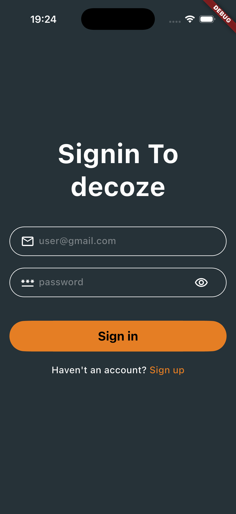</td>
    <td>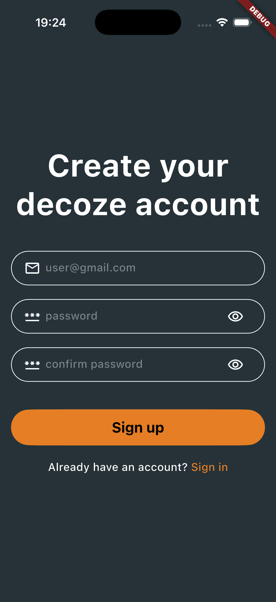</td>
    <td>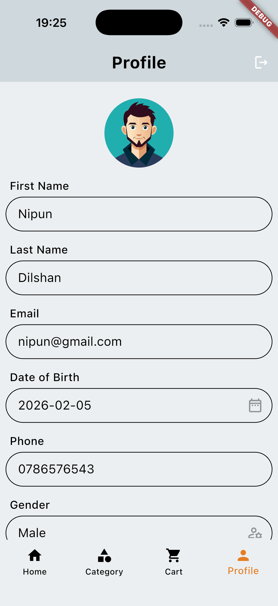</td>
    <td>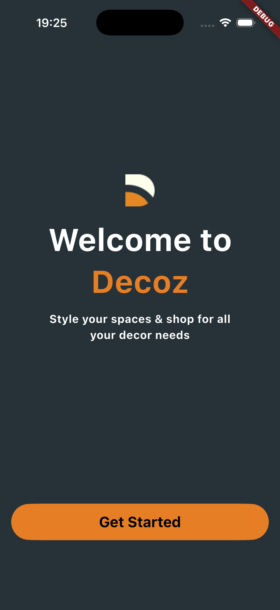</td>
    <td>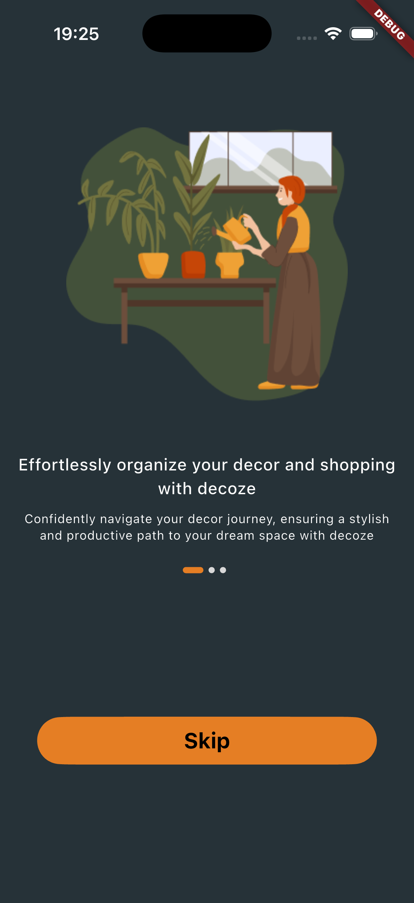</td>
  </tr>
  <!-- Row 2 -->
  <tr>
    <td>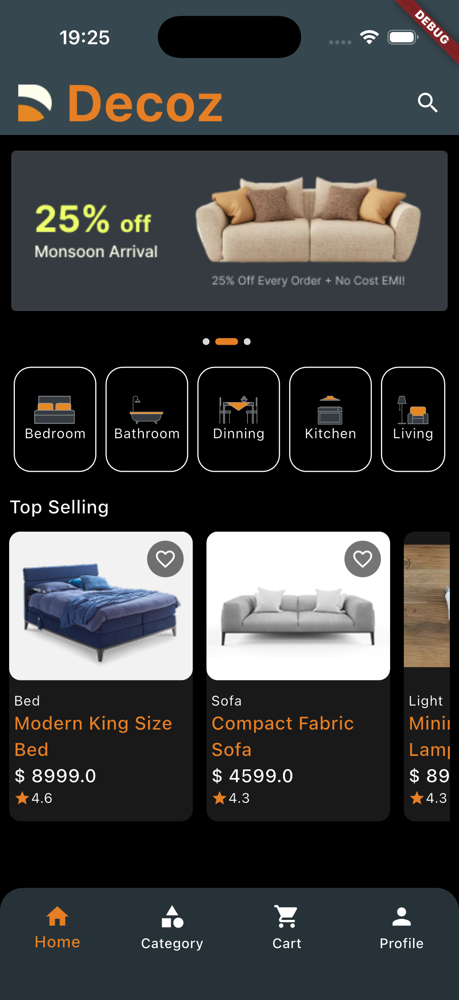</td>
    <td>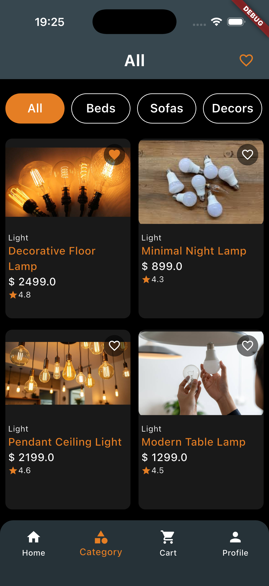</td>
    <td>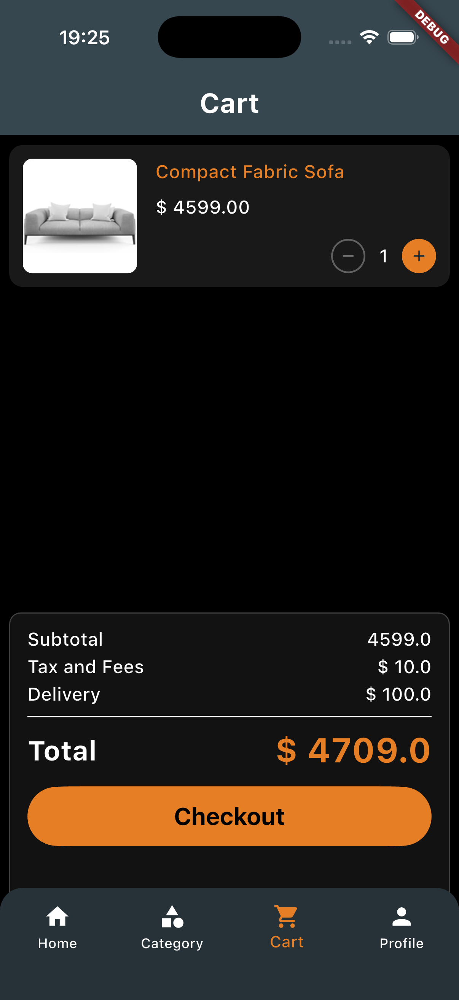</td>
    <td>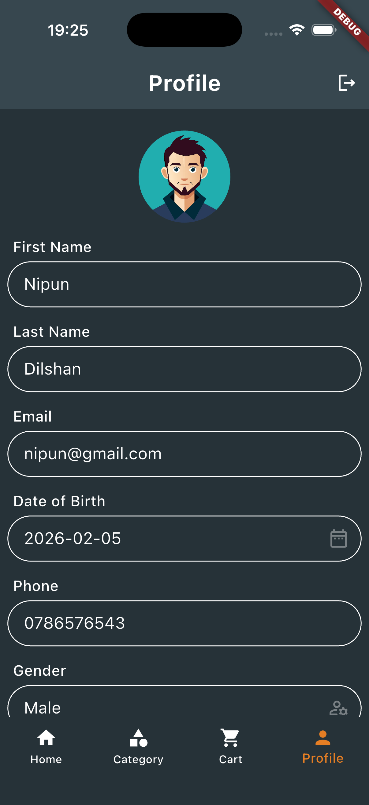</td>
    <td>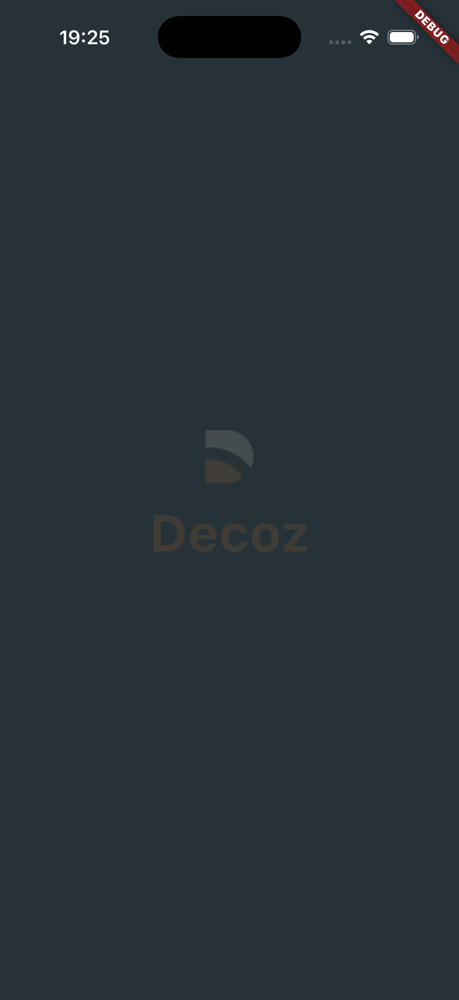</td>
  </tr>

   <!-- Row 3 -->
  <tr>
    <td>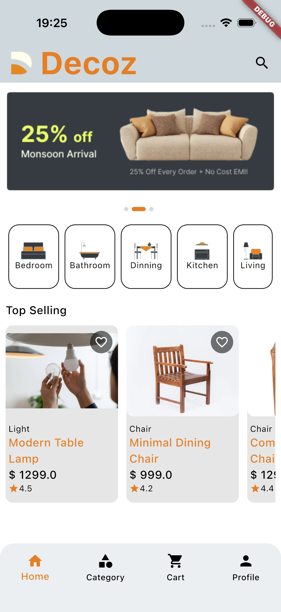</td>
    <td>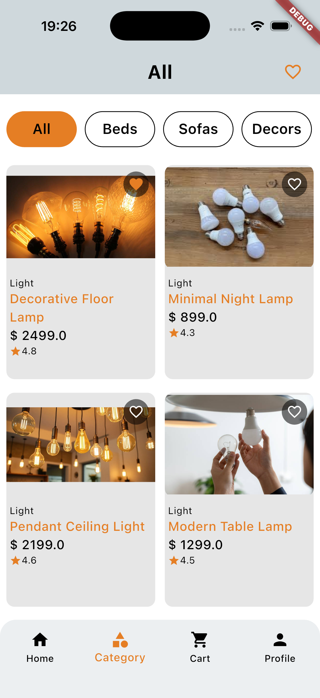</td>
    <td>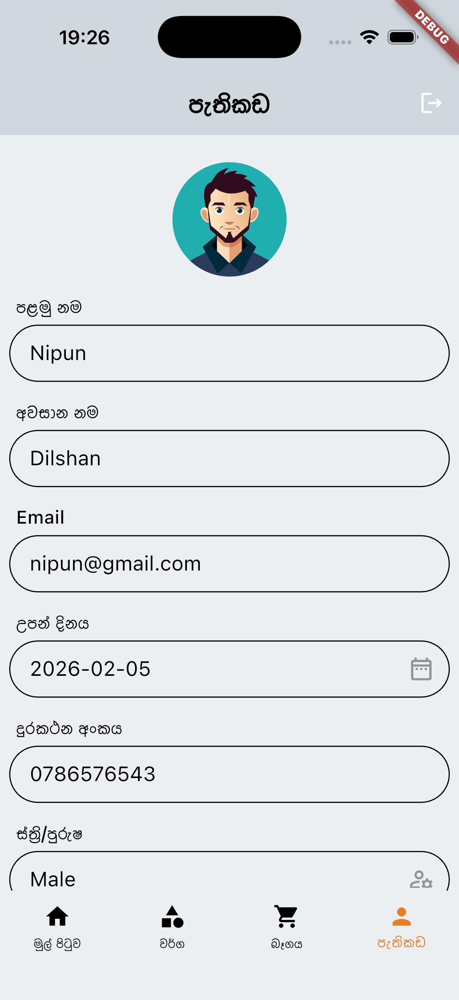</td>
    <td>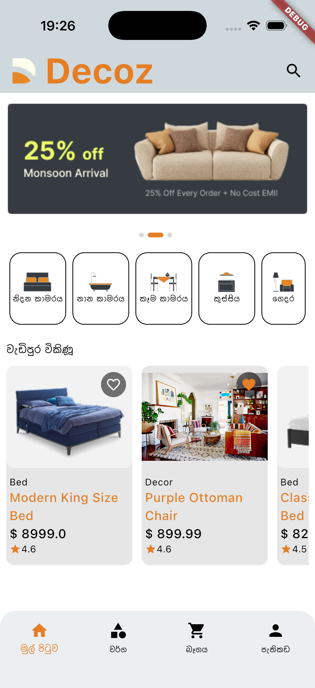</td>
    <td>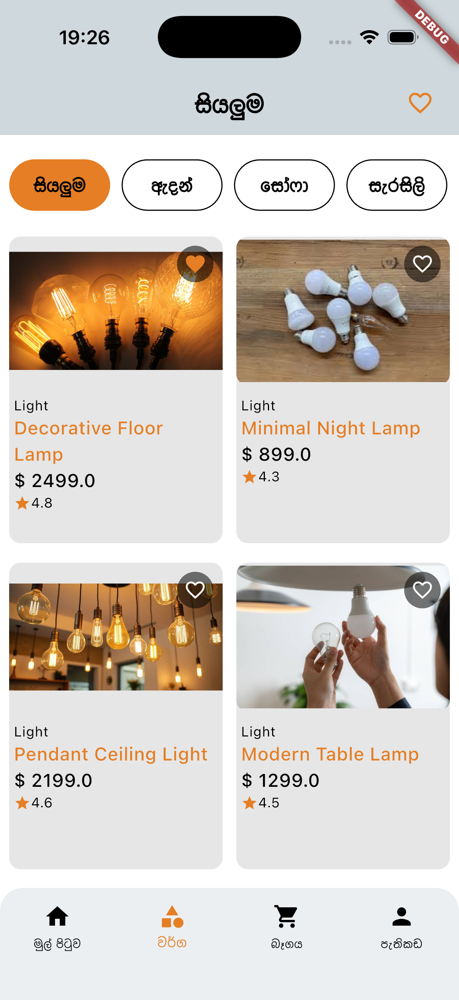</td>
  </tr>
</table>

---

Developed by Nipun Dilshan 🚀
